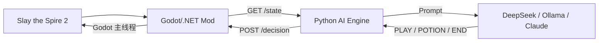
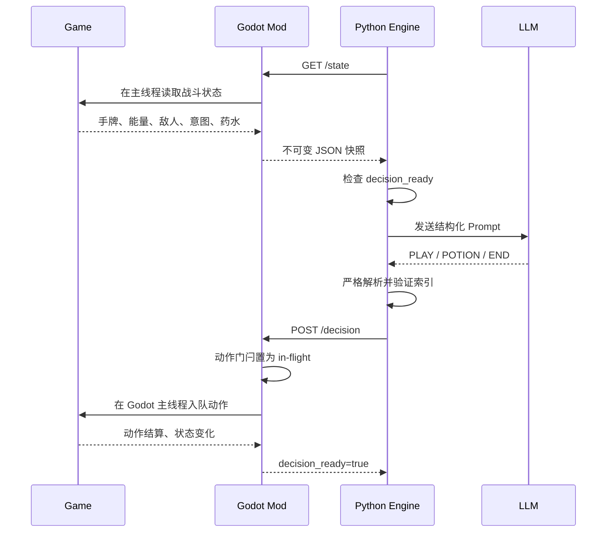

# Slay the Spire 2 AI Agent 架构

本文档描述当前可运行的 Slay the Spire 2 自动战斗架构。游戏侧使用 Godot/.NET Mod，决策侧使用 Python 和文本大模型，全程不依赖截图或视觉识别。

## 系统总览



核心职责：

- `mod/`：从游戏内存生成结构化战斗状态，并在 Godot 主线程执行动作。
- `engine/`：轮询状态、构建 Prompt、调用模型、校验响应并发送动作。
- `config/`：保存模型和策略配置；真实 API Key 使用被 Git 忽略的 `config/api_key.yaml`。

## 目录结构

```text
.
├── mod/                       # Godot/.NET Mod
│   ├── src/
│   │   ├── CombatHooks.cs
│   │   ├── DecisionExecutor.cs
│   │   ├── HttpServer.cs
│   │   ├── MainThreadDispatcher.cs
│   │   ├── Models.cs
│   │   ├── StateReader.cs
│   │   └── StateSnapshotCache.cs
│   ├── deploy.ps1
│   └── Sts2AiMod.csproj
├── engine/                    # Python 决策引擎
│   ├── communication/
│   ├── decisions/
│   ├── llm/
│   ├── state/
│   ├── tests/
│   └── main.py
├── config/
├── architecture/
└── run.ps1
```

## 战斗决策流程



## HTTP API

服务默认监听 `http://127.0.0.1:18888`。

### `GET /state`

返回当前游戏快照，关键字段包括：

- `decision_ready`：是否允许提交下一条动作。
- `action_in_flight`：上一条动作是否仍在队列中。
- `action_in_progress`：游戏是否正在结算卡牌或药水效果。
- `state_revision`：真实游戏状态变化时递增。
- `player.phase`：当前玩家回合阶段，只有 `Play` 可手动操作。
- `monsters[].intent_damage` 和 `intent_hits`：通过游戏的 `AttackIntent` 计算。
- `monsters[].targetable` 和 `target_index`：与动作接口使用同一目标索引。
- `hand[].uuid`：同名卡牌也具有不同的运行时标识。
- `deck[]`：当前完整牌组，供路线、奖励、商店和事件决策使用。
- `options[]`：当前非战斗界面的所有可执行选择，包含稳定索引、类型、说明、费用和关联模型。
- `map.nodes[]`：当前章节完整地图 DAG；每个节点包含房间类型、坐标和子节点。
- `teammates[]`：队友公开状态，包括血量、格挡、能量、手牌数量、回合和阶段，不读取队友手牌内容。
- `team_actions[]`：游戏 `CombatHistory` 中本回合已经发生的玩家动作，供协作和滚动重规划使用。

### `GET /status`

返回连接状态、战斗状态、动作门闩和状态版本。

### `POST /decision`

支持以下战斗动作：

```json
{"type":"play_card","hand_index":0,"monster_index":1}
```

```json
{"type":"use_potion","potion_slot":0,"monster_index":1}
```

```json
{"type":"end_turn"}
```

所有非战斗界面统一使用当前 `options[].index`：

```json
{"type":"choose_option","option_index":0}
```

该通用动作覆盖战斗奖励、卡牌/遗物/卡牌包选择、地图、普通与多阶段事件、古代事件、篝火、商店、宝箱、药水替换和继续/跳过按钮。胜利房间、水晶球、Fake Merchant 和游戏结算界面使用显式处理；未知事件在没有已识别选项时，会把事件作用域内所有可见且可用的点击控件作为 `fallback` 选项暴露。

动作尚未结算时再次提交会返回 HTTP `409` 和 `status=busy`。

## 并发与失败策略

游戏对象具有主线程约束，因此 Mod 使用以下边界：

1. HTTP 后台线程接收请求。
2. `MainThreadDispatcher` 将状态读取或动作执行切换到 Godot 主线程。
3. `StateSnapshotCache` 将完整状态序列化为不可变 JSON。
4. HTTP 线程只读取缓存，不直接访问场景树或战斗对象。
5. `DecisionGate` 保证同一时间最多有一个动作。

Python 引擎采用校验、保底和自动恢复策略：

- 模型网络错误、空响应或无法识别的最后一行不会直接发送到 Mod。
- 越界手牌、不可用卡牌、无效敌人索引和不可用药水会在 Agent 侧被拒绝。
- 模型不可用或输出非法时，战斗只从当前合法手牌和目标中选择保底动作；没有合法牌时结束回合。
- 非战斗保底会避开已卡住的选项，并优先沿用卡牌评估或全图路线评分。
- 没有可用卡牌时由确定性逻辑发送 `END`，无需调用模型。
- Mod 拒绝动作时不会把当前状态误标为已处理；Agent 使用最长 30 秒的指数退避重试，成功后立即恢复正常频率。
- 动作被接受但 12 秒后仍停留在相同可决策状态时，Agent 会解除同屏去重并重新决策。
- 非战斗选项若未推动状态，会被标记为 `STALLED_PREVIOUSLY`；存在其他选项时模型优先改选。
- 单轮未知解析或界面异常只会触发 2 秒退避，不会终止无人值守主循环。

## 战略决策

- **整回合滚动规划**：根据能量枚举可行牌序列，估算伤害、格挡、击杀攻击者后避免的伤害和最终掉血；每张牌结算后使用最新状态重新规划。
- **动态血量预算**：将来袭伤害分为 `LOW/MEDIUM/HIGH/LETHAL`，允许健康状态下用少量生命换击杀或节奏，高风险时优先生存。
- **卡组评估**：统计输出、防御、过牌、成长、能量和 AoE 职责，识别卡组缺口、费用曲线与重复饱和，给候选卡计算边际适配分。
- **全图路线评分**：遍历每个可选入口到章节终点的所有路径，根据血量、金币、普通怪/精英奖励密度、问号、篝火和商店动态评分。
- **多人协作**：默认等待仍处于 `Play` 阶段的队友先行动，读取其真实战斗历史后再规划；20 秒超时后主动行动，避免多个 Agent 互相等待。

## 模型输出协议

模型必须在最后一行输出一条命令：

```text
PLAY <hand_index> <monster_index>
POTION <slot> <monster_index>
END
CHOOSE <option_index>
```

响应解析器只读取最后一个非空行，避免把推理正文中的示例误当成动作。

## 配置与运行

模型配置位于 `config/ai_config.yaml`。API Key 建议写入本机文件：

```yaml
llm:
  api_key: "your-api-key"
```

该文件路径为 `config/api_key.yaml`，已被 `.gitignore` 排除。

常用命令：

```powershell
# 构建 Mod
dotnet build .\mod\Sts2AiMod.csproj

# 部署 Mod
powershell -NoProfile -ExecutionPolicy Bypass -File .\mod\deploy.ps1

# 运行测试
py -m pytest .\engine\tests

# 无 API 冒烟测试
.\run.ps1 -DryRun

# 使用 DeepSeek
.\run.ps1 -Backend deepseek
```

## 当前能力边界

当前已经实机验证：

- 单敌人和多敌人目标选择。
- 单段攻击意图伤害。
- 卡牌、药水和结束回合。
- 并发动作拒绝和动作完成恢复。
- 完整无视觉轮询决策链路。
- 战斗奖励领取、卡牌选择、完整牌组更新和地图选路。
- 通用节点协议可覆盖事件、篝火、商店、宝箱及其衍生选择界面。

特殊事件不按事件名称硬编码，而是读取游戏实时生成的可用选项。游戏版本更新若引入全新的非标准控件类型，需要通过实机回归确认该控件仍可被通用节点扫描识别。

## 验证标准

提交前至少执行：

```powershell
dotnet build .\mod\Sts2AiMod.csproj
py -m pytest .\engine\tests
```

实机验证时还应检查：

- Godot 日志不存在 `SceneTree is only allowed from the main thread`。
- Mod 日志不存在 `Main thread action timed out`。
- 动作期间 `decision_ready=false`，完成后恢复为 `true`。
- 多敌人动作只影响指定 `target_index`。
