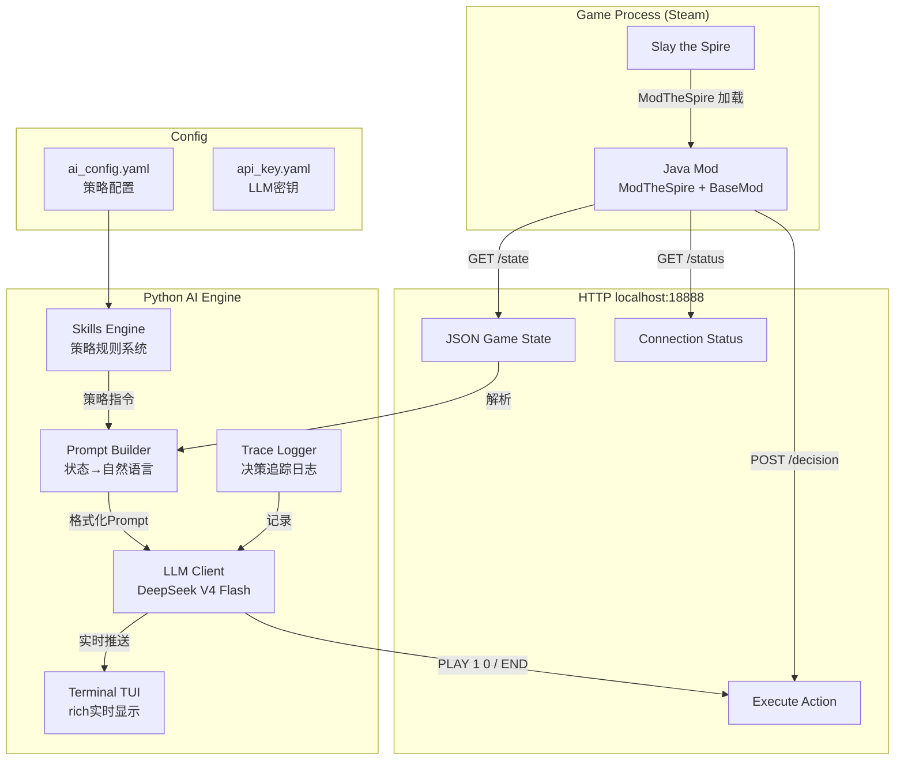
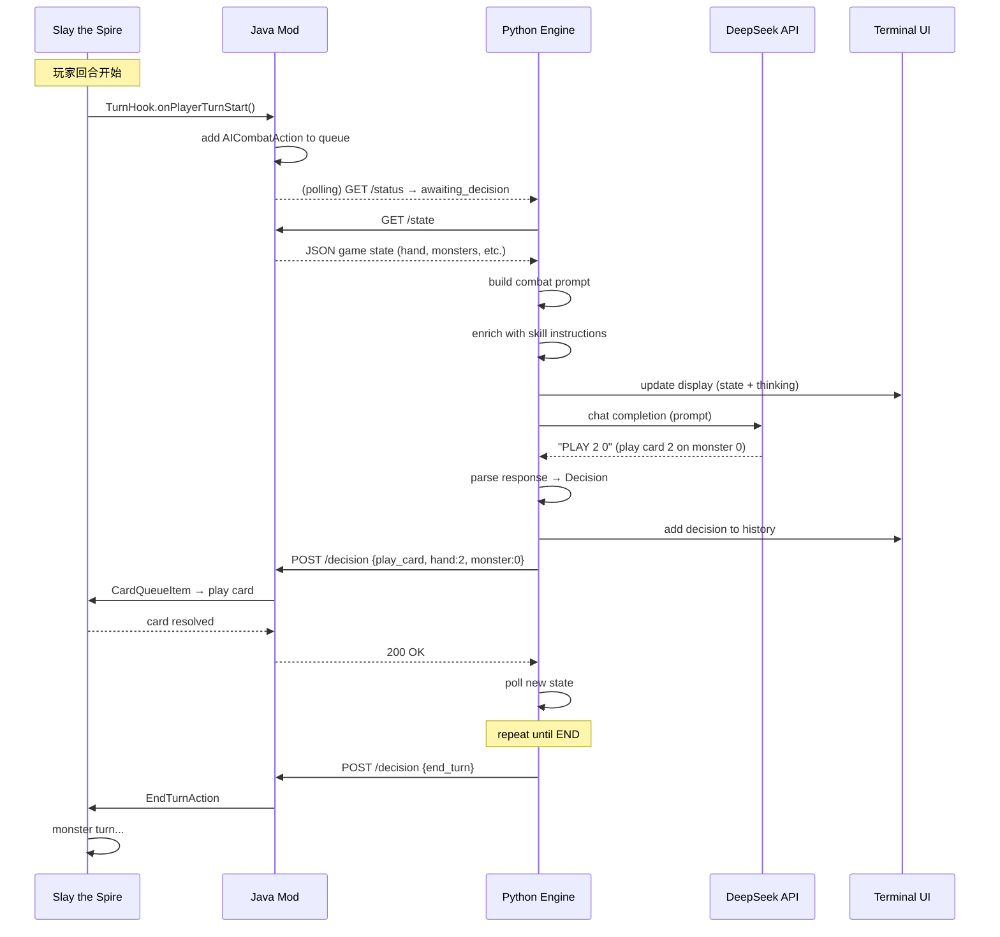
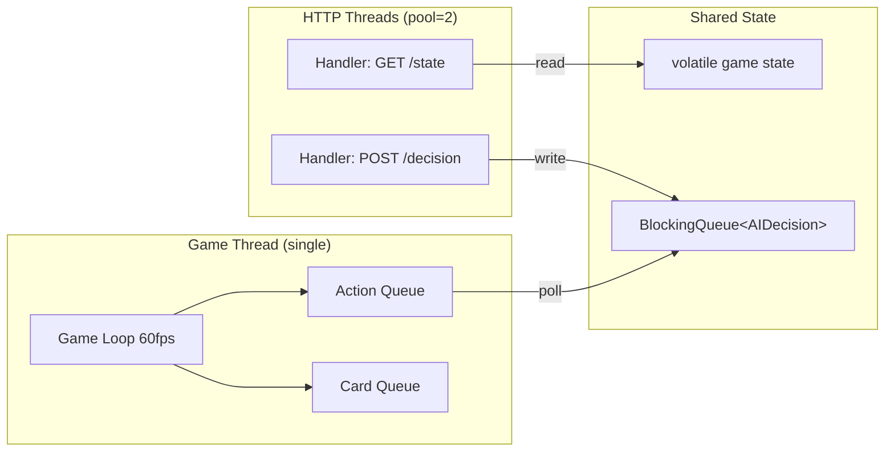
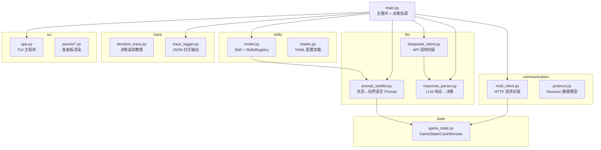

# Slay the Spire AI Agent — 技术路线架构图

> 本文档面向后续参与开发的 AI 开发者，说明整个系统的架构、数据流、关键设计决策和扩展方式。

---

## 目录

1. [系统架构总览](#1-系统架构总览)
2. [组件交互流程](#2-组件交互流程)
3. [数据流详解](#3-数据流详解)
4. [Java Mod 层](#4-java-mod-层)
5. [Python AI 引擎层](#5-python-ai-引擎层)
6. [LLM 决策链路](#6-llm-决策链路)
7. [Skills 策略系统](#7-skills-策略系统)
8. [关键设计决策](#8-关键设计决策)
9. [扩展指南](#9-扩展指南)
10. [调试与测试](#10-调试与测试)

---

## 1. 系统架构总览



### 核心原则

- **Mod 只管读和做** — Java Mod 只做两件事：读取游戏状态、执行指令。不做任何决策。
- **Python 只管想** — AI 引擎负责所有决策，通过 HTTP 与 Mod 通信。
- **LLM 是大脑** — 所有出牌决策由 DeepSeek V4 Flash（或其他 LLM）做出。
- **Skills 是行为约束** — 不直接改权重，而是通过 Prompt 指令引导 LLM 行为。

---

## 2. 组件交互流程

### 2.1 战斗决策时序



### 2.2 线程安全模型



**关键约束**：游戏引擎是单线程的（libGDX 主循环），所有 Mod 操作必须在游戏线程执行。`AICombatAction` 是一个 `AbstractGameAction`，被添加到游戏的动作队列中，每一帧检查 `BlockingQueue` 是否有新的决策。

---

## 3. 数据流详解

### 3.1 游戏状态 JSON 格式

Mod 通过 `GET /state` 返回的 JSON 结构：

```json
{
  "screen_type": "COMBAT",
  "in_combat": true,

  "player": {
    "current_hp": 52, "max_hp": 75, "block": 0,
    "energy": 3, "energy_this_turn": 3,
    "powers": [{"id": "Strength", "name": "Strength", "amount": 2}]
  },

  "monsters": [
    {
      "id": "JawWorm", "name": "Jaw Worm",
      "current_hp": 33, "max_hp": 46, "block": 0,
      "intent": "ATTACK", "intent_damage": 12, "intent_hits": 1,
      "powers": [], "is_gone": false, "half_dead": false
    }
  ],

  "hand": [
    {
      "uuid": "abc-123", "id": "Strike_R", "name": "Strike",
      "cost": 1, "type": "ATTACK", "has_target": true,
      "is_playable": true, "upgrades": 0,
      "damage": 6, "block": 0, "magic_number": 0,
      "exhausts": false, "ethereal": false,
      "description": "Deal 6 damage."
    }
  ],

  "draw_pile_count": 7,
  "discard_pile": [...],
  "exhaust_pile": [...],

  "relics": [{"id": "BurningBlood", "name": "Burning Blood", "counter": -1}],
  "potions": [{"slot": 0, "id": "HealthPotion", "name": "Health Potion", "can_use": true}],

  "turn": 1, "act": 1, "floor": 3,
  "ascension_level": 0, "class": "IRONCLAD"
}
```

### 3.2 Prompt → LLM → 决策 转换

```mermaid
flowchart LR
    A[JSON Game State] --> B[Prompt Builder]
    B --> C[Formatted Prompt]
    C --> D[DeepSeek API]
    D --> E["PLAY 2 0"]
    E --> F[Response Parser]
    F --> G[Decision]
    G --> H[POST /decision]
    
    subgraph "Prompt 示例"
        C1[You are an expert StS AI...]
        C2[## Monsters<br/>[0] Jaw Worm HP 33/46<br/>Intent: ATTACK 12]
        C3[## Your Hand<br/>[0] Strike 1 cost ATTACK<br/>[2] Defend 1 cost SKILL]
        C4[## Available Actions]
    end
```

### 3.3 决策循环控制

```python
# main.py — 核心决策逻辑
while running:
    state = client.get_state()
    
    if should_act(state):
        prompt = build_prompt(state, skills_instructions)
        response = llm.think(prompt)       # 调用 DeepSeek
        decision = parse(response)          # 解析 "PLAY 2 0"
        client.post_decision(decision)      # 发给 Mod 执行
        
    time.sleep(0.3)  # 300ms 轮询间隔
```

`should_act()` 判断条件：
- `in_combat == true`
- `hand` 中有可玩的卡牌
- 状态哈希发生变化（新回合 / 刚打出卡牌 / 状态更新）

---

## 4. Java Mod 层

### 4.1 文件清单

| 文件 | 职责 | 关键 API |
|------|------|----------|
| `SpireAIMod.java` | Mod 入口，初始化 | `@SpireInitializer`, `BaseMod.subscribe()` |
| `AIServer.java` | HTTP 服务器 + 决策队列 | `HttpServer`, `BlockingQueue<AIDecision>` |
| `AIDecision.java` | 决策数据模型 + JSON 解析 | `fromJson()`, `Type.PLAY_CARD / END_TURN` |
| `GameStateReader.java` | 读取游戏状态 → JSON | `AbstractDungeon.player`, `.hand`, `.monsters` |
| `ActionExecutor.java` | 执行游戏指令（备用） | `addCardQueueItem()`, `EndTurnAction` |
| `AICombatAction.java` | 等待 AI 决策的 Action | `AbstractGameAction`, `decisionQueue.poll()` |
| `BattleHook.java` | 战斗开始/结束 Hook | `OnStartBattleSubscriber`, `PostBattleSubscriber` |
| `TurnHook.java` | 回合开始 Hook | `OnPlayerTurnStartSubscriber` |

### 4.2 关键实现细节

#### 游戏状态读取
```java
// GameStateReader 核心：直接读取游戏内存对象
AbstractPlayer p = AbstractDungeon.player;
p.hand.group          // 手牌 (ArrayList<AbstractCard>)
p.drawPile.group      // 抽牌堆
p.discardPile.group   // 弃牌堆

AbstractDungeon.getMonsters().monsters  // 怪物列表
m.intent              // 意图枚举 (ATTACK/BUFF/DEBUFF/...)
m.getIntentDmg()      // 意图伤害（已调整）
m.powers              // 所有 Buff/Debuff
```

#### 出牌执行
```java
// 通过 CardQueueItem 打出卡牌（和玩家点击出牌走同一流程）
AbstractDungeon.actionManager.addCardQueueItem(
    new CardQueueItem(card, target, card.energyOnUse, true),
    true
);
```

#### AI 等待机制
```java
// AICombatAction 是一个 AbstractGameAction
// 被添加到游戏 Action Queue 中
// 每帧执行 update() → 检查 decisionQueue 是否有新决策
public void update() {
    AIDecision d = decisionQueue.poll();
    if (d == null) return;  // 没有决策 → 等待下一帧
    
    if (d.type == PLAY_CARD) {
        // 打出一张牌
        AbstractDungeon.actionManager.addCardQueueItem(...);
        // 不设置 isDone，继续等待下一张牌
    } else if (d.type == END_TURN) {
        // 结束回合
        AbstractDungeon.actionManager.addToBottom(new EndTurnAction());
        this.isDone = true;
    }
}
```

### 4.3 HTTP API 端点

| 端点 | 方法 | 说明 |
|------|------|------|
| `/state` | GET | 完整游戏状态 JSON |
| `/status` | GET | `{in_battle, awaiting_decision, in_game}` |
| `/decision` | POST | 接收 AI 决策并执行 |

`POST /decision` 请求格式：
```json
{"type": "play_card", "hand_index": 0, "monster_index": 0}
{"type": "end_turn"}
{"type": "use_potion", "potion_slot": 0, "monster_index": 0}
```

---

## 5. Python AI 引擎层

### 5.1 模块结构



### 5.2 关键数据模型

```python
@dataclass
class Card:
    uuid: str           # 唯一标识
    card_id: str        # "Strike_R" (游戏内部 ID)
    name: str           # "Strike"
    cost: int           # 能量消耗
    card_type: str      # ATTACK / SKILL / POWER
    damage: int         # 当前伤害值
    block: int          # 当前格挡值
    is_playable: bool   # 能否打出
    description: str    # 原始描述文字

@dataclass
class Monster:
    monster_id: str     # "JawWorm"
    name: str           # "Jaw Worm"
    current_hp: int     # 当前血量
    max_hp: int         # 最大血量
    block: int          # 当前格挡
    intent: str         # ATTACK / BUFF / DEBUFF / DEFEND
    intent_damage: int  # 意图伤害
    intent_hits: int    # 攻击段数
    powers: list[dict]  # [{"id":"Strength", "amount":2}]

@dataclass
class GameState:
    player_hp, player_max_hp, player_block, player_energy
    hand: list[Card]
    monsters: list[Monster]
    draw_pile_count: int
    discard_pile: list[Card]
    relics: list[dict]
    potions: list[dict]
    turn: int
    act: int
    floor: int
    in_combat: bool
```

---

## 6. LLM 决策链路

### 6.1 Prompt 模板结构

```
## System Role
You are an expert Slay the Spire AI...

## Strategy (在 Skills 启用时插入)
- If any monster's intent is ATTACK, prioritize block...
- [其他 Skill 指令]

## Player Status
HP: 52/75 | Block: 0 | Energy: 3/3
Powers: Strength (2)

## Monsters
[0] Jaw Worm | HP: 33/46 | Intent: ATTACK 12 damage

## Your Hand
[0] Strike | Cost: 1 | Deal 6 damage  ← 可玩
[1] Defend | Cost: 1 | Gain 5 block    ← 可玩
[2] Bash   | Cost: 2 | Deal 8 + Vuln  ← 可玩

## Available Actions
PLAY <hand_index> <monster_index>
END
```

### 6.2 LLM 响应格式

LLM 只需输出一行命令，支持三种格式：

| 格式 | 示例 | 含义 |
|------|------|------|
| `PLAY <i> [j]` | `PLAY 2 0` | 打出手牌索引 i，目标怪物 j |
| `END` | `END` | 结束当前回合 |
| `POTION <s> [j]` | `POTION 0 0` | 使用药水槽 s，目标 j |

也兼容 JSON 格式：
```json
{"type": "play_card", "hand_index": 2, "monster_index": 0}
```

### 6.3 响应解析器

```python
# response_parser.py 解析逻辑
def parse_llm_response(text: str) -> Decision:
    # 1. JSON 格式检测
    if text.startswith("{"):
        return parse_json(text)
    
    # 2. PLAY 格式
    if "PLAY" in text:
        match = re.search(r'PLAY\s+(\d+)(?:\s+(\d+))?', text)
        return Decision.play_card(match[1], match[2])
    
    # 3. END 格式
    if "END" in text:
        return Decision.end_turn()
    
    # 默认：结束回合（安全兜底）
    return Decision.end_turn()
```

### 6.4 LLM 配置参数

```yaml
# DeepSeek V4 Flash 推荐配置
model: "deepseek-chat"    # 实际 = deepseek-v4-flash
temperature: 0.3          # 低温度保证一致性
max_tokens: 128           # 输出只需几个 token
```

---

## 7. Skills 策略系统

### 7.1 设计哲学

Skills 不是抽象的数值滑块，而是**具体的可开关行为规则**。每个 Skill 是一条自然语言指令，在构建 Prompt 时插入到 **Strategy** 章节。

```yaml
# ❌ 错误做法（不可量化）
aggression: 0.7
conservation: 0.3

# ✅ 正确做法（具体规则）
skills:
  block_when_attacked: true    # "怪物攻击时优先出格挡牌"
  focus_fire: true             # "集火血量最低的目标"
  save_potions: true           # "HP低于30%才用药水"
```

### 7.2 内置 Skills 清单

| ID | 名称 | 描述 | Prompt 指令 |
|----|------|------|-------------|
| `focus_fire` | 集火残血 | 优先攻击最低血量怪物 | `Priority target: the monster with the lowest current HP.` |
| `block_when_attacked` | 防御优先 | 怪物攻击时先格挡 | `If any monster's intent is ATTACK and block < damage, prioritize block.` |
| `save_potions` | 省用药水 | HP<30%或Boss才用 | `Only use potions when HP < 30% or facing a boss.` |
| `no_overkill` | 避免过量 | 合理分配伤害 | `Avoid overkill: allocate excess damage to other targets.` |
| `setup_first` | 蓄爆优先 | 先Buff后输出 | `Prioritize playing setup cards (powers, buffs) before dealing damage.` |
| `aoe_priority` | 群攻优先 | 多目标用AOE | `Against 2+ enemies, prioritize AoE/multi-target cards.` |
| `conserve_energy` | 保留能量 | 留费给下回合 | `Consider saving 1 energy for next turn if you have key cards.` |
| `aggressive` | 激进输出 | 最大化伤害 | `Prioritize dealing maximum damage. Acceptable to take damage.` |
| `elite_path` | 精英路线 | 路线偏好精英 | `Prioritize routes with more elite encounters.` |

### 7.3 预设策略

| 预设 | 启用的 Skills | 适用场景 |
|------|---------------|---------|
| `balanced` | （无）默认行为 | 通用 |
| `aggressive` | focus_fire + no_overkill + aggressive | 快速击杀，低风险战斗 |
| `defensive` | block_when_attacked + save_potions + conserve_energy | 高难度战斗，保血量 |
| `setup` | setup_first + aoe_priority + focus_fire | 需要叠Buff的后期卡组 |

### 7.4 自定义 Skill 示例

在 `config/ai_config.yaml` 中添加：

```yaml
custom_skills:
  my_ironclad_combo:
    name: "铁甲爆发"
    description: "优先叠力量然后重刃收尾"
    prompt_instruction: >
      If you have Spot Weakness or Inflame in hand,
      play them before any attack that deals multiple hits.
      Prioritize setting up Strength before Heavy Blade.
    category: "combat"
    priority: 10
    enabled: true
```

### 7.5 Skill 生效链路

```mermaid
flowchart LR
    subgraph "配置层"
        YAML[ai_config.yaml]
    end
    
    subgraph "注册层"
        DEFAULT[Built-in Defaults]
        CUSTOM[Custom Skills]
        PRESET[Preset Mappings]
    end
    
    subgraph "执行层"
        ENGINE[SkillsRegistry]
        INSTR[get_enabled_instructions()]
    end
    
    subgraph "应用层"
        PROMPT[Prompt Builder]
        LLM_DECISION[LLM Decision]
    end
    
    YAML --> CUSTOM
    YAML --> PRESET
    DEFAULT --> ENGINE
    CUSTOM --> ENGINE
    PRESET --> ENGINE
    ENGINE --> INSTR
    INSTR -->|strategy_instructions| PROMPT
    PROMPT -->|"## Strategy\n- block first..."| LLM_DECISION
```

---

## 8. 关键设计决策

### 8.1 为什么用 LLM 而不是搜索/规则？

| 方案 | 优点 | 缺点 |
|------|------|------|
| **纯 LLM（当前方案）** | 理解卡牌 synergy，风格灵活，可解释 | 有延迟（~1s），有 token 成本 |
| 搜索+评估函数 | 确定性强，无延迟 | 需要手写所有卡牌逻辑，难以处理复杂 synergy |
| 强化学习 | 理论上限高 | 极难训练，目前没有成功的公开方案 |

结论：LLM 是最快能取得好效果的方案。如果未来需要降低延迟/成本，可以：
- 前置一个**规则缓存层**（简单情况不走 LLM）
- 把 LLM 换成**本地模型**（如通过 Ollama 部署）

### 8.2 为什么每步只让 LLM 出一张牌？

而不是让 LLM 一次输出整回合的牌序（"PLAY 2 0, PLAY 0 0, END"）。

**原因**：
1. 卡牌打出后的结果不确定（抽牌、随机效果）
2. LLM 需要看到中间状态才能做后续决策
3. 拆分成单步决策，每步上下文清晰，准确率高

### 8.3 为什么用 Mod 而不是屏幕识别？

| 方式 | 可靠性 | 开发量 | 信息完整性 |
|------|--------|--------|-----------|
| **Mod（当前方案）** | 100% 精确 | 中 | 全部游戏状态 |
| 屏幕截图 + OCR | 易出错（UI缩放、特效遮挡） | 大 | 只能看到屏幕上的 |
| 内存直接读取 | 版本更新易失效 | 大 | 完整但危险 |

### 8.4 HTTP 而不是 stdin/stdout？

Mod 内置 HTTP 服务器（Java `com.sun.net.httpserver.HttpServer`）：
- 不需要将 Python 路径配置到游戏
- Python 进程可独立启停
- 调试方便（curl 直接测试）
- 无端口冲突（检测占用后自动换端口）

---

## 9. 扩展指南

### 9.1 添加新角色支持

目前卡牌描述直接从游戏 JSON 的 `rawDescription` 字段读取，LLM 靠自身知识理解。要增强准确率：

1. 在 `engine/state/` 下创建角色卡牌数据库（JSON/YAML）
2. 在 `prompt_builder.py` 中，对已知卡牌用数据库描述替代 rawDescription
3. 数据库示例：
```yaml
cards:
  Strike_R:
    name: "打击"
    description: "造成 6 点伤害"
    tags: ["basic", "attack"]
    synergy: ["strength", "vulnerable"]
```

### 9.2 添加新 Skill

1. 在 `engine/skills/model.py` 的 `_load_defaults()` 中添加：
```python
Skill(
    id="my_new_skill",
    name="技能名称",
    description="技能描述",
    prompt_instruction="具体的 LLM 指令文本",
    category="combat",
)
```
2. 或在 `config/ai_config.yaml` 的 `custom_skills` 中添加

### 9.3 切换 LLM 模型

修改 `config/ai_config.yaml` 或环境变量：

```bash
# 切换到 Claude
export ANTHROPIC_API_KEY=sk-...
# 然后修改 main.py 中使用的 client

# 切换到本地 Ollama
OLLAMA_URL=http://localhost:11434
```

注意：不同 LLM 对 Prompt 格式的敏感度不同，切换后可能需要调整 `prompt_builder.py`。

### 9.4 添加非战斗决策

目前的实现专注于**战斗内决策**。要添加完整游戏辅助：

1. **卡牌选取**：在 `prompt_builder.py` 中添加新模板
2. **路线规划**：Mod 已读取地图数据（`AbstractDungeon.map`），Python 端需添加解析
3. **事件选择**：监听 `screen_type` 变化，在非 COMBAT 状态下触发新决策流

文件组织建议：
```
engine/
├── decisions/
│   ├── combat.py         ← 当前战斗逻辑
│   ├── card_reward.py    ← 卡牌选取
│   ├── map_path.py       ← 路线规划
│   └── event.py          ← 事件决策
```

### 9.5 多人模式支持

多人模式需要：
1. Mod 读取其他玩家的出牌记录（通过 `PostUpdateSubscriber` 监听动作）
2. 将队友行动添加到 Prompt 的上下文中
3. 添加 Skills：`coordinate_with_teammate`（如 "如果队友正在集火某目标，优先攻击同一目标"）

---

## 10. 调试与测试

### 10.1 快速验证 LLM 决策

```bash
cd engine
source venv/bin/activate

# 测试 DeepSeek 连通性
python3 -c "
from llm.deepseek_client import DeepSeekClient
import os
client = DeepSeekClient(os.environ['DEEPSEEK_API_KEY'])
resp, elapsed = client.think('Say hello', temperature=0)
print(f'{resp} ({elapsed:.2f}s)')
"
```

### 10.2 验证 Mod HTTP 接口

```bash
# Mod 启动后
curl http://127.0.0.1:18888/status
# → {"in_battle":false,"awaiting_decision":false,"in_game":true}

curl http://127.0.0.1:18888/state
# → {完整的游戏状态 JSON}

curl -X POST http://127.0.0.1:18888/decision \
  -H "Content-Type: application/json" \
  -d '{"type":"end_turn"}'
# → {"status":"ok"}
```

### 10.3 日志追踪

每次决策都会记录到 `engine/logs/battle_*.json`：

```json
{
  "character": "IRONCLAD",
  "ascension": 0,
  "act": 1,
  "won": null,
  "steps": [
    {
      "turn": 1,
      "llm_response": "PLAY 3 0",
      "decision": "PLAY 3 0",
      "elapsed_ms": 1140
    }
  ]
}
```

### 10.4 常见问题

| 问题 | 原因 | 解决 |
|------|------|------|
| Mod 无法加载 | `ModTheSpire.jar` 版本不匹配 | 确认使用 Steam Workshop 最新版 |
| HTTP 连接失败 | Mod 未启动或端口被占用 | 检查 `http://127.0.0.1:18888/status` |
| LLM 返回空/错误响应 | API Key 无效或网络问题 | 检查 `config/api_key.yaml` |
| 决策明显不合理 | Prompt 不够清晰 | 调整 `prompt_builder.py` 或添加 Skill |
| TUI 不显示 | `rich` 库未安装 | `pip install rich` |
| 游戏卡住不动 | Mod 等待 AI 决策，但 AI 未连接 | 启动 `./run.sh` |

---

> **最后建议**：保持 Mod 层尽可能薄，所有智能逻辑放在 Python 端。
> 这样修改决策逻辑时不需要重新编译 Mod，只需重启 Python 引擎即可热更新。
